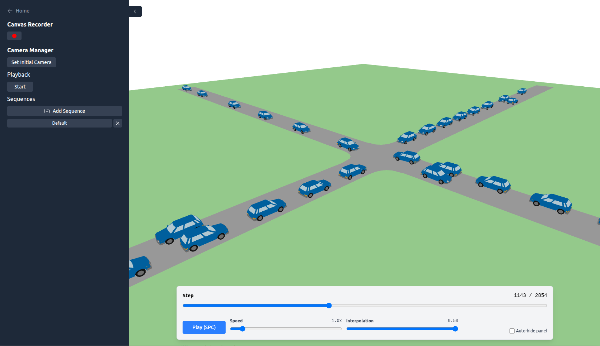
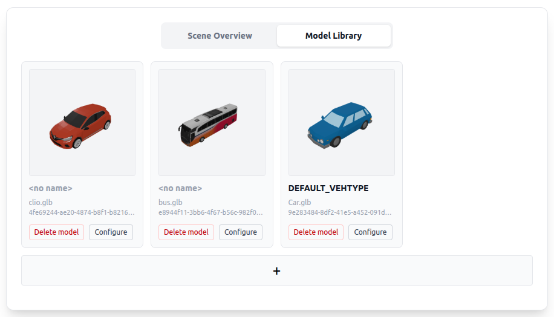
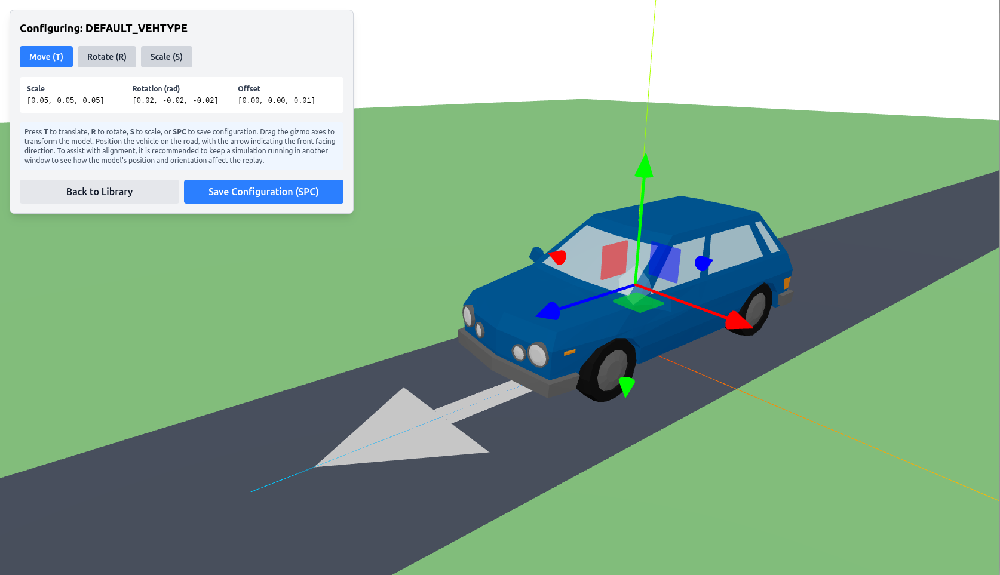

# 3D Visualization for SUMO Traffic Simulations

Replay traffic simulations using [SUMO network files](https://sumo.dlr.de/docs/Networks/SUMO_Road_Networks.html) and [SUMO floating car data](https://sumo.dlr.de/docs/Simulation/Output/FCDOutput.html).
Interactive web-based visualization with support for custom 3D vehicle models and programmable camera movement. Some experimental supports for recording high-quality videos of the visualizations directly from the browser.


## ✨ Features

- Draw SUMO road networks with lane markings (solid edges and dashed lane dividers)
- Replay vehicle movements from floating car data
- Import custom vehicle models with configurable dimension and reference point
- Programmable sequences of camera movement
- Built-in screen recorder for easy video capture



## 🚀 Getting started

Prebuilt executables for Windows are available on the [Releases page](https://github.com/jeroenvanriel/traffic-viz/releases).

### Creating a new scene

Each scene is defined by a folder inside the `scenes/` directory. A valid scene must contain:

- `road.net.xml` — the SUMO network file

- `fcd.xml` — floating car data output

Follow SUMO's [Hello World](https://sumo.dlr.de/docs/Tutorials/Hello_World.html) tutorial to create a simple SUMO simulation. Make sure to use `road.net.xml` as the name for the network file.
After verifying that the simulation runs in `sumo-gui`, use the command `sumo -c helloWorld.sumocfg --fcd-output fcd.xml` to create a floating car data export of the simulation; see [FCDOutput](https://sumo.dlr.de/docs/Simulation/Output/FCDOutput.html) for more information.

> 💡 **Tip:** Instead of using the graphical [`netedit`](https://sumo.dlr.de/docs/Netedit/index.html) tool, you can also use the [osmWebWizard.py](https://sumo.dlr.de/docs/Tools/Import/OSM.html) script, included with SUMO, to easily create realistic traffic scenarios by importing map data from OpenStreetMap. For more information, see the [OpenStreetMap import documentation](https://sumo.dlr.de/docs/Networks/Import/OpenStreetMap.html).

### Importing custom vehicle models

In the Model Library tab of the sidebar, you can upload custom 3D models to be used as vehicle representations in the visualization.
To use a custom model, rename the model to match the `type` attribute of the corresponding vehicle in the SUMO network file. For example, if a vehicle has `type="DEFAULT_VEHTYPE"`, you can name a model accordingly like in the screenshot below.



Since models from different sources may have different dimensions and reference points, the Model Configurator allows you to adjust the scale and position of each model to ensure they are displayed correctly in the scene.
While keeping the scene visualization open in another window, adjust the model's position, scale and orientation and use the space key to update and see how those changes affect the appearance in the visualization. Especially the midpoint of models is important to make turning movements look natural.



## Development

The Python backend is build using the FastAPI library. The frontend is written in Typescript and uses the React framework.

```bash
cd backend
pip install .[dev]
fastapi dev app/main.py
```

```bash
cd frontend
npm install
npm run dev
```

### Some technical details

- The backend parses the network file and converts it into polygon data.
- Solid edge markings are computed by offsetting the union of all lane polygons.
- Dashed lane dividers for multi-lane edges are computed from the lane centerlines, which are provided in the network files.
- Computing dashed lane dividers for opposite lanes is a bit more involved. It involves identifying pairs of opposite lanes, then offsetting the lanes slightly and then using the overlap to compute their shared border.
- Vehicle movements are streamed as *delta packets*, minimizing redundant data transfer. To enable fast seeking, the backend also precomputes a set of *snapshots* at regular intervals, which contain the full state of the scene at that step.


## Acknowledgements

This project was heavily inspired by the ideas and design of 
[SUMO‑Web3D](https://github.com/sidewalklabs/sumo-web3d) 
by Sidewalk Labs (licensed under the Eclipse Public License v2.0).
Early development of this project was funded by [NWO](https://www.nwo.nl/en) as part of ["Implementing Stochastic Models for Intersections with Regulated Traffic" (ISMIRT)](https://www.nwo.nl/en/projects/43920616) and a preliminary version of the visualization was presented during the ["ISMIRT Workshop on Urban Traffic Management and Control"](https://www.utwente.nl/en/eemcs/sor/events/symposia/220610_ISMIRT%20workshop%20on%20Urban%20Traffic%20Management%20and%20control/).
